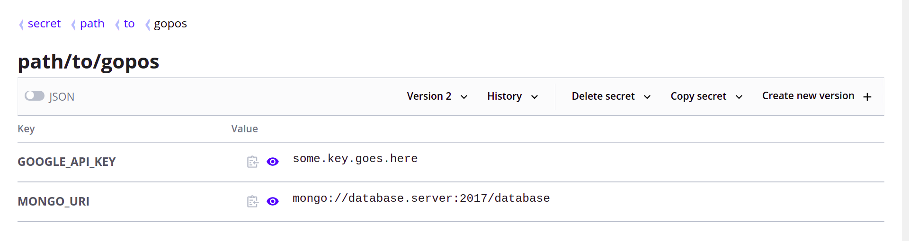

# Configuration

This application is configured through environment variables. The following table defines which settings are supported.

| **Variable** | **Description** | **Default** |
|----------|-------------|:------:|
| `GOOGLE_API_KEY` | The key to use to authenticate with the Google Maps API. Leave this blank to disable | _(blank)_ |
| `MONGO_URI` | The connection string to a Mongo database that can be used to store calls to the Google Maps API. Leave this blank to disable caching | _(blank)_ |

## Vault
For secure environments, environment variables can also be supplied via [Hashicorp Vault](https://github.com/hashicorp/vault).

| **Variable** | **Description** | **Default** |
|----------|-------------|:------:|
| `VAULT_ADDR` | The address at which the Vault server is running. Leave this blank to not use Vault. | _(blank)_ |
| `VAULT_SECRETS_PATH`* | The path at which the variables are declared in Vault. | _(blank)_ |
| `VAULT_TOKEN` | The token to access the secrets on the Vault server. | _(blank)_ |

*Example: In this screenshot, the value of `VAULT_SECRETS_PATH` is equal to `secret/data/path/to/gopos`. **Notice the extra `/data/` in the path.**

## Advanced

| **Variable** | **Description** | **Default** |
|----------|-------------|:------:|
| `GOOGLE_API_BASE` | The url at which the Google Maps API must be reached. This can be overridden for testing purposes. | `https://maps.googleapis.com` |